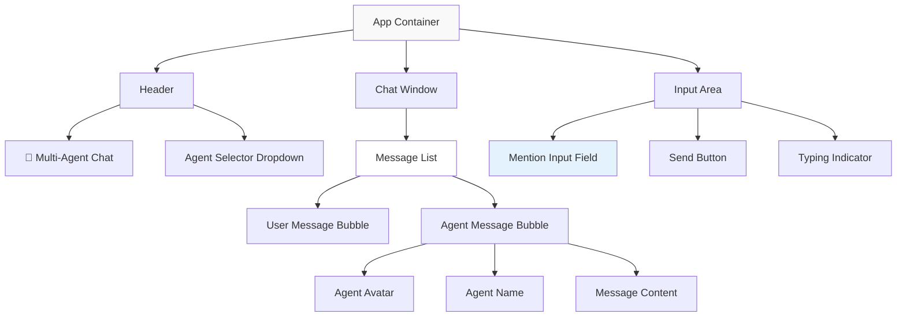

## 🎨 Frontend Implementation Plan (React 18 + TypeScript + Vite)

### High-Level UI Wireframe



### Main Component Architecture

#### Core Components & Their Responsibilities

```typescript
// App.tsx - Root component
interface AppProps {}
interface AppState {
  messages: Message[]
  agents: Agent[]
  isLoading: boolean
  currentSession: string
}

// ChatWindow.tsx - Message display container
interface ChatWindowProps {
  messages: Message[]
  isLoading: boolean
}

// MessageBubble.tsx - Individual message display
interface MessageBubbleProps {
  message: Message
  agent?: Agent
  isUser: boolean
}

// ChatInput.tsx - Message input with mention parsing
interface ChatInputProps {
  onSendMessage: (content: string, mentionedAgent?: string) => void
  agents: Agent[]
  isLoading: boolean
}

// AgentSelector.tsx - Available agents display
interface AgentSelectorProps {
  agents: Agent[]
  onAgentSelect: (agentId: string) => void
}
```

#### Data Models

```typescript
interface Message {
  id: string
  content: string
  author: 'user' | string // user or agent name
  timestamp: Date
  mentionedAgent?: string
}

interface Agent {
  id: string
  name: string
  systemPrompt: string
  avatar: string
  description: string
}
```

#### Component Interactions

```typescript
// State flow: App → ChatWindow → MessageBubble
// Action flow: ChatInput → App (handleSendMessage) → API → App (updateMessages)
// Mention parsing: ChatInput (detectMention) → App (routeToAgent)
```

### Recommended Folder Structure

```
/home/azureuser/repo/Multimind/frontend/
├── public/
│   ├── vite.svg
│   └── index.html
├── src/
│   ├── components/
│   │   ├── atoms/
│   │   │   ├── Avatar.tsx
│   │   │   ├── Button.tsx
│   │   │   ├── Input.tsx
│   │   │   └── Spinner.tsx
│   │   ├── molecules/
│   │   │   ├── MessageBubble.tsx
│   │   │   ├── ChatInput.tsx
│   │   │   ├── AgentTag.tsx
│   │   │   └── TypingIndicator.tsx
│   │   ├── organisms/
│   │   │   ├── ChatWindow.tsx
│   │   │   ├── ChatInputArea.tsx
│   │   │   └── AgentSelector.tsx
│   │   └── templates/
│   │       └── MainLayout.tsx
│   ├── hooks/
│   │   ├── useChat.ts
│   │   ├── useMentionParser.ts
│   │   └── useAgents.ts
│   ├── services/
│   │   ├── api.ts
│   │   ├── agentService.ts
│   │   └── chatService.ts
│   ├── types/
│   │   ├── message.ts
│   │   ├── agent.ts
│   │   └── api.ts
│   ├── utils/
│   │   ├── mentionParser.ts
│   │   ├── dateFormatter.ts
│   │   └── constants.ts
│   ├── styles/
│   │   ├── globals.css
│   │   └── components.css
│   ├── __tests__/
│   │   ├── components/
│   │   ├── hooks/
│   │   ├── utils/
│   │   └── setup.ts
│   ├── App.tsx
│   ├── main.tsx
│   └── vite-env.d.ts
├── package.json
├── tsconfig.json
├── vite.config.ts
├── tailwind.config.js
├── jest.config.js
└── README.md
```

### User Stories (BDD Format)

#### Story 1: Basic Message Sending
**Given** the user is on the chat page
**When** the user types "Hello world" and clicks send
**Then** the message should appear in the chat window with a user avatar

#### Story 2: Agent Mention Detection
**Given** the user is typing in the input field
**When** the user types "@ProductManager"
**Then** the system should highlight the mention and show the ProductManager agent

#### Story 3: Agent Response Display
**Given** the user has sent a message mentioning "@Developer"
**When** the API returns a response from the Developer agent
**Then** the chat should display the agent's message with the Developer avatar and name

#### Story 4: Conversation Context Preservation
**Given** there are existing messages in the chat
**When** the user mentions an agent
**Then** the agent should have access to the full conversation history

#### Story 5: Input Validation
**Given** the user is typing a message
**When** the user tries to send an empty message
**Then** the send button should be disabled and no message should be sent

#### Story 6: Loading State Management
**Given** the user has sent a message
**When** the system is waiting for an agent response
**Then** a typing indicator should be displayed

#### Story 7: Agent Selection via Dropdown
**Given** the user wants to see available agents
**When** the user clicks on the agent selector
**Then** a dropdown should show all available agents with their descriptions

### Test Cases (Jest + React Testing Library)

#### Test Suite Structure

```typescript
// __tests__/components/ChatWindow.test.tsx
describe('ChatWindow Component', () => {
  test('renders messages correctly', () => {
    // Given: A list of messages
    // When: ChatWindow is rendered
    // Then: All messages should be displayed
  })

  test('shows loading indicator when isLoading is true', () => {
    // Given: isLoading prop is true
    // When: ChatWindow is rendered
    // Then: Loading indicator should be visible
  })
})

// __tests__/components/ChatInput.test.tsx
describe('ChatInput Component', () => {
  test('detects agent mentions in input', () => {
    // Given: User types @ProductManager
    // When: Input value changes
    // Then: Mention should be detected and highlighted
  })

  test('calls onSendMessage with correct parameters', () => {
    // Given: User types a message with agent mention
    // When: Send button is clicked
    // Then: onSendMessage should be called with content and mentionedAgent
  })

  test('disables send button for empty input', () => {
    // Given: Input field is empty
    // When: Component is rendered
    // Then: Send button should be disabled
  })
})

// __tests__/components/MessageBubble.test.tsx
describe('MessageBubble Component', () => {
  test('renders user message correctly', () => {
    // Given: A user message
    // When: MessageBubble is rendered
    // Then: Should show user styling and content
  })

  test('renders agent message with avatar and name', () => {
    // Given: An agent message with agent data
    // When: MessageBubble is rendered
    // Then: Should show agent avatar, name, and content
  })
})

// __tests__/hooks/useMentionParser.test.tsx
describe('useMentionParser Hook', () => {
  test('extracts agent mentions from text', () => {
    // Given: Text with @AgentName mention
    // When: Hook processes the text
    // Then: Should return extracted agent name
  })

  test('returns null for text without mentions', () => {
    // Given: Text without any mentions
    // When: Hook processes the text
    // Then: Should return null
  })
})

// __tests__/utils/mentionParser.test.ts
describe('mentionParser Utility', () => {
  test('parses single agent mention', () => {
    expect(parseMentions('@Developer hello')).toEqual(['Developer'])
  })

  test('parses multiple agent mentions', () => {
    expect(parseMentions('@PM and @Developer discuss')).toEqual(['PM', 'Developer'])
  })

  test('returns empty array for no mentions', () => {
    expect(parseMentions('hello world')).toEqual([])
  })
})
```

### Setup & Run Guide

#### Prerequisites
- Node.js 18+ and npm/yarn
- Git

#### Step-by-Step Setup

```bash
# 1. Clone the repository
git clone https://github.com/yourusername/Multimind.git
cd Multimind

# 2. Navigate to frontend directory
cd frontend

# 3. Install dependencies
npm install
# or
yarn install

# 4. Install additional dependencies for our stack
npm install --save-dev @types/react @types/react-dom
npm install --save-dev @testing-library/react @testing-library/jest-dom
npm install --save-dev jest @types/jest ts-jest
npm install tailwindcss autoprefixer postcss
npm install lucide-react # for icons

# 5. Initialize Tailwind CSS
npx tailwindcss init -p

# 6. Create environment file
cp .env.example .env.local
# Edit .env.local with your API endpoints
```

#### Development Commands

```bash
# Start development server
npm run dev
# Opens http://localhost:5173

# Run tests
npm run test

# Run tests in watch mode
npm run test:watch

# Run tests with coverage
npm run test:coverage

# Build for production
npm run build

# Preview production build
npm run preview

# Lint code
npm run lint

# Format code
npm run format
```

#### Project Configuration Files

```json
// package.json scripts section
{
  "scripts": {
    "dev": "vite",
    "build": "tsc && vite build",
    "preview": "vite preview",
    "test": "jest",
    "test:watch": "jest --watch",
    "test:coverage": "jest --coverage",
    "lint": "eslint src --ext ts,tsx --report-unused-disable-directives --max-warnings 0",
    "format": "prettier --write src/**/*.{ts,tsx}"
  }
}
```

```typescript
// vite.config.ts
import { defineConfig } from 'vite'
import react from '@vitejs/plugin-react'

export default defineConfig({
  plugins: [react()],
  server: {
    port: 5173,
    proxy: {
      '/api': {
        target: 'http://localhost:8000',
        changeOrigin: true
      }
    }
  }
})
```

```javascript
// jest.config.js
module.exports = {
  preset: 'ts-jest',
  testEnvironment: 'jsdom',
  setupFilesAfterEnv: ['<rootDir>/src/__tests__/setup.ts'],
  moduleNameMapping: {
    '^@/(.*)$': '<rootDir>/src/$1'
  },
  collectCoverageFrom: [
    'src/**/*.{ts,tsx}',
    '!src/**/*.d.ts',
    '!src/main.tsx'
  ]
}
```

#### Verification Steps

```bash
# 1. Verify development server starts
npm run dev
# Should see "Local: http://localhost:5173"

# 2. Verify tests run
npm run test
# Should see "Test Suites: X passed"

# 3. Verify build works
npm run build
# Should create dist/ folder

# 4. Verify TypeScript compilation
npx tsc --noEmit
# Should complete without errors
```

#### Troubleshooting

| Issue | Solution |
|-------|----------|
| Port 5173 already in use | Change port in vite.config.ts or kill existing process |
| TypeScript errors | Run `npm run lint` and fix reported issues |
| Test failures | Check test setup and ensure all dependencies are installed |
| Build failures | Verify all imports are correct and types are properly defined |

This implementation plan provides a solid foundation for building the Multi-Persona AI Chat Application with modern React practices, comprehensive testing, and clear development workflows.

-----
