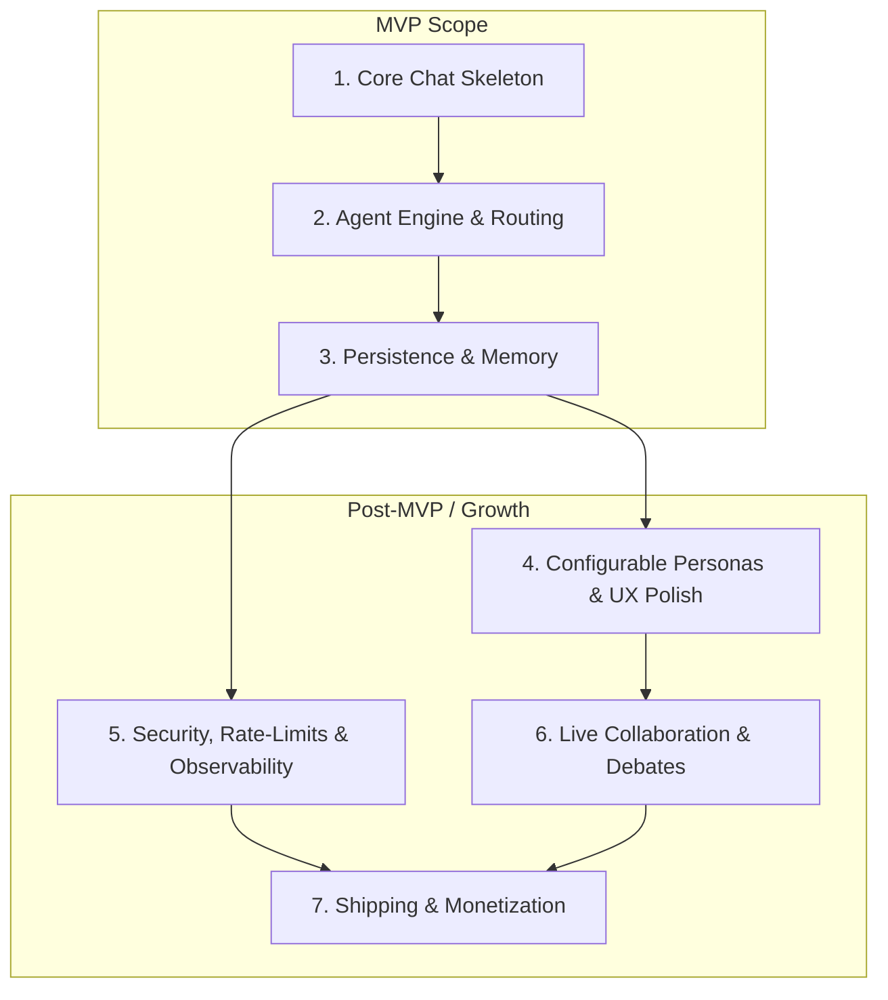

## 🗺️ Phased Rollout Plan

### Phase 1: Core Chat Skeleton

  * **Goal:** Stand up a Next.js page with a hard-coded agent (`DevHelper`) to see a complete request/response loop on `localhost`.
  * **Tasks:** Scaffold UI, parse `@AgentName`, send a prompt to GPT-3.5, and print the reply.

### Phase 2: Agent Engine & Routing

  * **Goal:** Allow agents to be swapped or added by editing a single `agents.json` file, with no code changes required.
  * **Tasks:** Create the `agents.json` config. Build a FastAPI endpoint `/chat/send` to detect the mentioned agent and inject its system prompt.

### Phase 3: Persistence & Memory

  * **Goal:** Ensure that when a user refreshes the browser, the conversation is still there.
  * **Tasks:** Set up a SQLite database with tables for `chats`, `messages`, and `agents`. On page load, fetch the last N messages.

### Phase 4: Configurable Personas & UX Polish

  * **Goal:** Allow a non-technical user to create or tweak an agent's persona directly within the app.
  * **Tasks:** Build an "Agent Settings" modal. Enable Markdown rendering. Add optimistic UI updates and error toasts.

### Phase 5: Security, Rate-Limits & Observability

  * **Goal:** Make the app safe for a small public alpha without surprise cost spikes or security holes.
  * **Tasks:** Add optional authentication (Clerk/Auth.js). Implement per-user rate-limiting. Export Prometheus metrics for latency and cost.

### Phase 6: Live Collaboration & Debates (Post-MVP)

  * **Goal:** Simulate a mini-Slack with AI teammates discussing topics among themselves.
  * **Tasks:** Allow agents to reply to each other. Implement WebSockets for real-time updates. Add "rooms" to separate chats by topic.

### Phase 7: Shipping & Monetization (Post-MVP)

  * **Goal:** Reach the first $100 MRR and gather usage analytics to prioritize the next version.
  * **Tasks:** Add a payment integration (Lemon Squeezy/Gumroad) for a "Pro" plan. Launch a landing page and post on Indie Hackers.

-----

## 🔗 Visual Dependency Graph

This graph shows the development dependencies between phases. A phase cannot start until the phases pointing to it are complete.

-----

## 📝 Detailed Task Breakdown
Phase 1 – Core Chat Skeleton
ID	Task Overview	UI (React/Next.js)	API (FastAPI or Next.js API route)	DB
1.1	Create Next.js workspace	—	—	—
1.2	Scaffold chat layout	Header, ChatWindow, InputBar, flex column CSS	—	—
1.3	Hard-code demo agent	Show DevHelper avatar & name in a mini legend	—	—
1.4	Mention parser	Highlight @AgentName chips while typing	—	—
1.5	OpenAI call loop	Call hook + loading state	Temporary /api/local route -> OpenAI	—
1.6	Basic logging	Console in browser (dev only)	Print request, latency on server	—

Phase 2 – Agent Engine & Routing
ID	Task Overview	UI	API	DB
2.1	agents.json config	Reload list on hot-refresh	Read file at startup	—
2.2	FastAPI service	—	Set up FastAPI app & /health	—
2.3	/chat/send endpoint	Call with chatId, text	Parse mention, call LLM, return JSON	—
2.4	Inject system prompt	—	Compose messages array before LLM call	—
2.5	Missing-agent error	Toast “Agent not found”	Return HTTP 400	—
2.6	Loading spinner	Animated dots under outgoing message	—	—

Phase 3 – Persistence & Memory
ID	Task Overview	UI	API	DB
3.1	DB schema & models	—	—	Create chats, messages, agents tables
3.2	Persist on send	—	Save user + agent messages	INSERT rows
3.3	Load history	Hydrate chat on page load	/chat/:id/history endpoint	SELECT last 50 msgs
3.4	Agent short-term memory	—	Read/Write agent_state column	JSON column per chat
3.5	Schema tests	—	Pytest fixture calls endpoints	Validate DB rows

Phase 4 – Configurable Personas & UX Polish
ID	Task Overview	UI	API	DB
4.1	Agent Settings modal	Modal form + inputs	/agent/:id PATCH	UPDATE agents
4.2	Markdown renderer	react-markdown, code-block theme	—	—
4.3	Optimistic updates	Instant bubble + rollback on error	Return final msg	—
4.4	Error toast system	Global <Toast /> atom	Raise toasts from fetch errors	—

Phase 5 – Security, Rate Limits & Observability
ID	Task Overview	UI	API	DB
5.1	Add Clerk auth	Sign-in page / modal	JWT middleware	users table
5.2	Rate-limit middleware	Error toast on 429	Redis/Token-bucket decorator	Optional Redis key TTL
5.3	Prometheus metrics	—	Expose /metrics	—
5.4	Grafana dashboard	Embed iframe (optional)	Provision alert rules	—
5.5	Secret management	—	Read from env-vars	—

Phase 6 – Live Collaboration & Debates
ID	Task Overview	UI	API	DB
6.1	WebSocket gateway	—	FastAPI WebSocket endpoint	—
6.2	Real-time push	Subscribe & stream bubbles	Publish on new message	—
6.3	Multi-agent debate	Render chain replies	Allow agent-to-agent trigger loop	Optional extra flag per chat
6.4	Rooms feature	Sidebar room list & creator	CRUD /rooms endpoints	rooms + FK in chats

Phase 7 – Shipping & Monetization
ID	Task Overview	UI	API	DB
7.1	Payment integration	Upgrade page + paywall banners	Lemon Squeezy webhook handler	users.plan, payments
7.2	Feature flags	Gate UI components	Unleash SDK, flags in headers	feature_flags (optional)
7.3	Landing page	Marketing site, email CTA	—	—
7.4	Beta launch & feedback	In-app NPS prompt	Collect /feedback POST	feedback table
7.5	MRR tracking job	—	Cron job aggregates Stripe revenue	revenue_daily table
